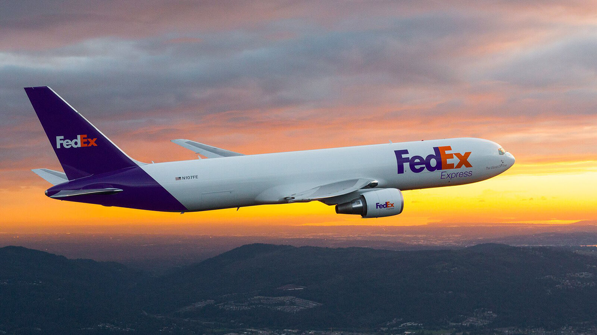
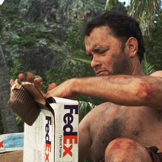
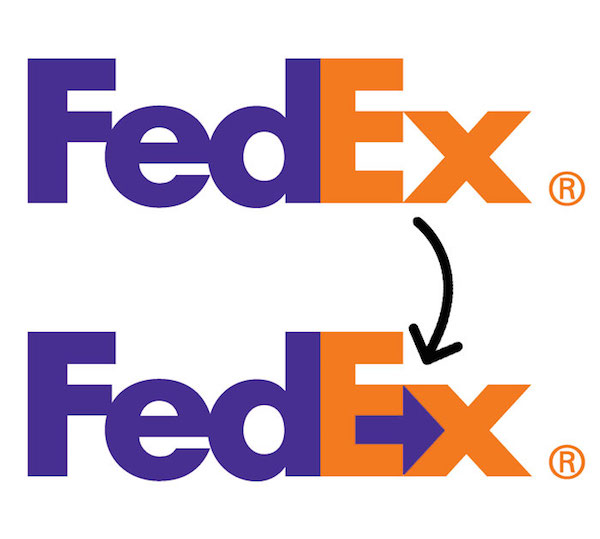
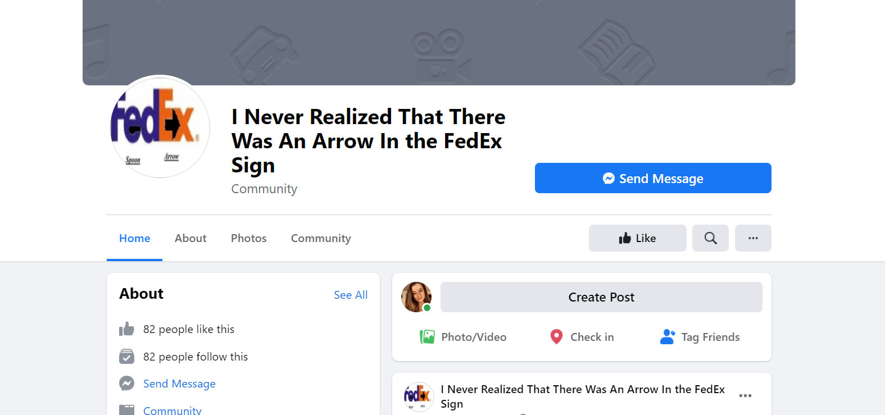

The FedEx Corporation, formally known as Federal Express, is an American multinational delivery service. As a company, FedEx strives to provide “high value-added logistics and transportation services”. As a transportation company, their logo is often found on the sides of vans and planes.

It even featured heavily in the 2000 hit movie Cast Away starring Tom Hanks as a stranded FedEx engineer. (Fantastic film – Highly Recommend!).

The FedEx logo is honestly one of my all-time favourite logo designs because of its ingenious use of negative space. Some of you may already know what I’m talking about … the hidden arrow!

Also, I’m clearly not the only one fascinated by this incredible design as there is an entire Facebook community dedicated to this hidden gem.

[Facebook community:](https://www.facebook.com/I-Never-Realized-That-There-Was-An-Arrow-In-the-FedEx-Sign-104249042940605/?ref=page_internal)

###### But why is the hidden arrow so clever? And how was it formed?

I believe the hidden arrow adds value to the logo because it illustrates the purpose of the company. Personally, I associate arrows with things like direction, travel and journeys which relate to the act of transporting and delivering.

The current FedEx logo was designed in 1994 by Lindon Leader of Landor Associates. In an interview with TheSneeze.com blog in 2004 Leader explained how he blended together two different typefaces in order to achieve the “unique and proprietary letterforms” illustrated in the FedEx branding. These two typefaces were Univers 67 and Futura Bold.

In order to achieve the uniformed look of the FedEx logo, Leader adjusted the x-heights in order to align the central line of the ‘E’ with the ‘X’ so it would form that iconic hidden arrow. Other adjustments such as shortening the ascender of the d and closing the letter spacing between the ‘d’ and the ‘E’ increased the seamless appearance.

Furthermore, I think the typeface is well suited to the brand because of its sans-serif, heavy weighted and minimal contrast appearance. It looks boxy and strong which gives off the impression of a sturdy and reliable company which again matches FedEx’s purpose are providing high-value delivery services. 

As for colour choice:

FedEx uses a Purple and Orange combination which are not often paired together which makes the brand stand out from other companies which use safer colour combinations.

Overall, as you've probably guessed I think this logo is extremely effective in its illustration of FedEx's brand values and reputation as a reliable delivery service.