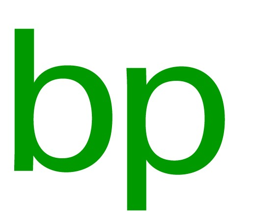
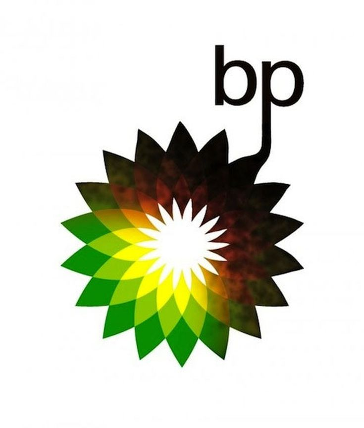

The British Petroleum Company PLC, otherwise known as BP, is one of the world's seven oil and gas "supermajors". Basically, one of the biggest oil companies in the world. I'm sure you've heard of them and if you haven't, I have no doubt that you will have seen their rather prominent logo around and about. You will often find it on the side of lorries or at a petrol station. 

I want you to imagine that you are looking at this logo for the first time with no context as to what this company does. What do you see? What do you think this company produces and values? Here are my thoughts: 

Firstly, I want to look closer at the letters BP. 

 These letters are written in the typeface Univers 55 Roman. 

The typeface is characterised by its sans-serif, regular width, regular weight, not hugely distinct contrast in thickness and marginally shorter ascenders and descenders. Altogether I would describe Univers 55 Roman as a pretty regular font. There is no exotic or stand out flair to it. It is simple, subtle and not a font I would necessarily pair with a company like BP. My reason for this is my association with an oil company would be big machinery, loud and in your face, and this typeface is the complete opposite of that. 

Secondly, the main colour of the logo as a whole is green. 

The colour green is generally associated with nature or eco-friendly and environmentally conscious companies which I would argue BP is not. Whilst the company has started work in areas of renewable and sustainable energy the majority of its income still lies with oil production. In addition, events over the last decade have proven their dedication to the environment is questionable. 

For example: 

* The BP oil spill in 2010, where 200 million gallons of crude oil poured into the Gulf of Mexico for 87 days, killing 8,000 animals in just 6 months. 
* BP also lobbied President Trump to weaken landmark environmental laws to make it harder to block new oil and gas projects on an environmental ground. 
* More recently, in 2019 BP did not back the Eu's plans for a net Zero carbon target by 2050. 

  > "you can't claim to be playing your part in tackling the climate emergency and then refuse to back the legislation we need to succeed," said John Sauven, the executive director of Greenpeace UK. 

In my opinion, the use of green is the company's way of using the marketing and PR practice of 'Greenwashing' which uses colour and styling to deceptively appear more environmentally conscious than they truly are. It is almost their way of hiding the negative environmental impact they are having. 

In conclusion, I think they're logo effectively builds their eco-friendly facade however, I don't believe it is an honest representation of their true company values and reputation. 

Perhaps if it was it would look more like this.

