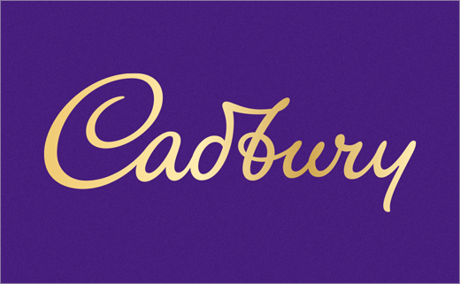
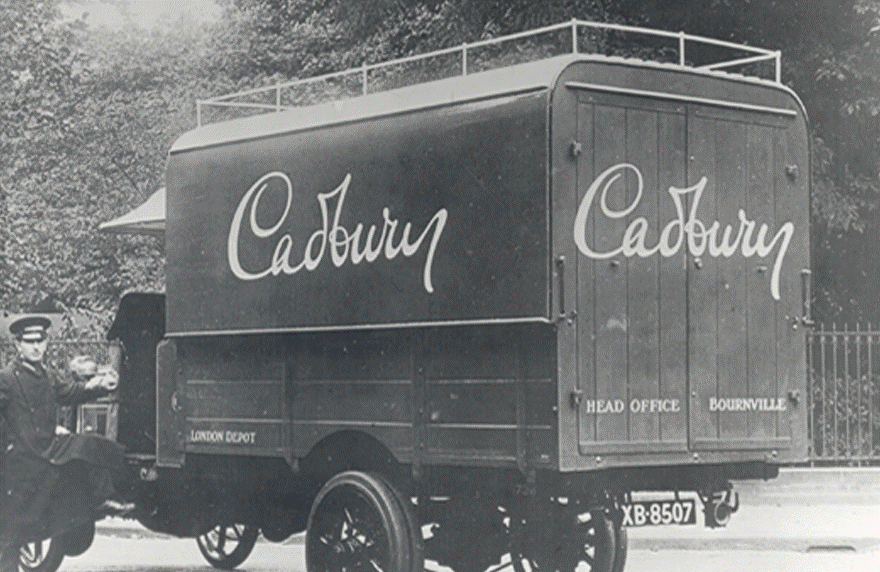

Cadbury, formerly known as Cadbury’s, is a British multinational confectionery company. It is the second-largest in the world but was recently voted the world’s favourite chocolate. Cadbury was founded in 1824 in Birmingham, England by John Cadbury. The company has “been inventing, inspiring and investing in a nation of chocolate lovers for nearly 200 years”. As a confectionery company, their logo is often found on the packaging of their products and transport vehicles.

The Cadbury brand has always had a strong reputation which is based on the company’s long heritage but also the quality of their products.

Firstly, the brand’s heritage comes from both age and the family who created it. The Cadbury family were famous for their charitable deeds and generosity which made them a public favourite. Their family values were at the core of the business until it was bought by Kraft in 2010. However, their family legacy lives on in the typographical choices of the logo.

The newest iteration of the branding was designed by bulletproof, an international brand and packaging agent, and was first debuted in April 2020 and should be fully launched by 2021.

As you can see their logo does not use a traditional typeface. The “font” used for the logo is actually based on the founder John Cadbury’s signature. I believe this is hugely symbolic of the real family nature of the company as it is their surname written by their own hand.

This style was first debuted in 1921 on the transportation fleet.

In terms of function, it is not particularly legible because of its cursive nature. Back in the day, cursive was very common however, with the development of technology, both print and digital, the text is predominantly written in block or print script. Thus, for a more modern consumer, who is not used to cursive writing, may struggle to decipher its many loops and intricacies. Nonetheless, I think that what it lacks in readability is made up for in symbolism and significance.    

Secondly, the quality of their product is portrayed through the use of colour.

There are two main colours to Cadbury branding.

Purple and Gold.

These two colours are very are often associated with luxury, royalty and power. Gold is a symbol of money and wealth due to the value of the metal it is named after. Whereas purple’s elite status comes from the rarity and cost of the dye originally used to create it so, purple fabric was hugely expensive so only the richest could afford it. Therefore, Cadbury has used these two colours to imply the quality and value of their own product.

Overall, I think Cadbury’s brand values are perfectly represented through their typographical choices even though there is a slight legibility issue. Fortunately, Cadbury is truly iconic and recognisable brand so, to be honest you don’t really need to read it.