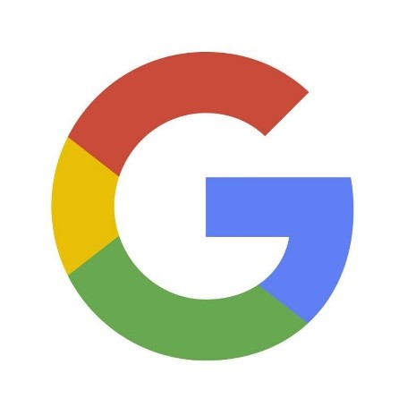
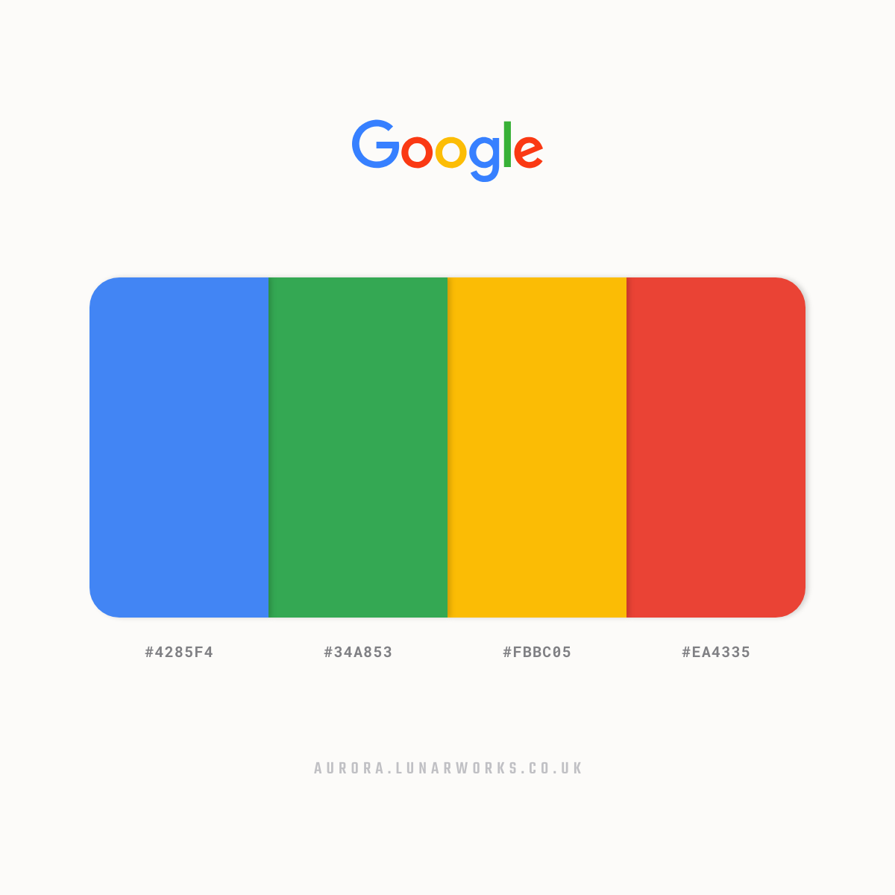

Google. Does it really need any introduction?

Google is an American multinational technology company that provides a wide variety of products and services including both software and hardware. Its most important specialism is its search engine service. Don’t believe me … Google it! It owns 90% of the search market and has 4 billion users worldwide.

As a brand, it values user-focused design such as a clear and simple homepage interface (very different to the over-cluttered interfaces of its competitors). It also aims to provide fast and seamless services.

Like many technological and online companies, their typographic choices have changed over time mostly due to the changing potential of technology and the new availability of software. Most recently, Google presented its new geometric sans serif typeface called Product Sans which is a Futura-like font designed in 2015.

The main reason for the change was due to Google needing a font that would be “a scalable mark that could convey the feeling of the full logotype in constrained spaces.” They needed a more practical design. 

The plain font perfectly illustrates Google’s goal of simplistic user-friendly design. It has a consistent thickness with zero contrast which maintains its geometric shapes, notably the Os and the G which makes it incredibly easy to read. I personally find this hugely pleasing as the geometric precision limits the amount of friction. Except for the wonky e on the end which disrupts the order of completely this little added extra which could bee so easily looked over is key to the true personality of Google as a company.

Google is one of the most cutting-edge companies in the world so don’t like to keep things conventional. Which is clearly highlighted by the slides they have in their office.

Moreover, Google’s use of colour furthers there need to break free from convention.

The colour choice had been part of Google’s logo from the very start. They have changed orientation a number of times but settled with the present layout in 1999. The colours are meant to  “convey that Google was just as recognisable as the first colour chart taught across the world.”  but again to break with convention the L is a secondary colour – green.

Overall, there is a very childlike simplicity and playfulness to the new logotype which makes it accessible to literally anyone which as a global brand is what they need. They have definitely achieved their aim to create a simple uncluttered user interface.

As Stephen Khan from The Conversation put it “It is a designer’s noblest aspiration to explain a complex world in simple ways.”