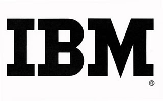

IBM, or International Business Machines Corporation, is an American technology and consulting company. It was founded in 1911 by Charles Ranlett Flint. As a company it is “dedicated to creating products and solutions with ever-evolving technological innovations”. One of its most notable achievements is that IBM computers helped put the first man on the moon.

The IBM logo is one of the most recognised logos in the world, yet you might not see it as often as other logos like Apple or Microsoft. This is a due to the nature of their products and services. IBM hardware like personal computers are less common amongst the population because of they have more advanced operating systems that aren’t required by many. Furthermore, a lot of their products are software and technology which tends to go unnoticed in our daily lives, for instance in our mobile phones.

IBM has said that their logo “is one of their most valuable corporate assets” because it provides a tangible symbol of their brand that represents everything they are: their expertise, values and products and services that aren’t physical entities.

Like many companies IBM has gone through many iterations of their logo however, the current logo was created by designer Paul Rand almost 50 years ago in 1972.

The plain version was used between 1956-1972 but was redesigned as the business went global.

In ’72 the horizontal stripes were added to suggest “speed and dynamism”.

Personally, I find the horizontal stripes affect the legibility of the letters, they almost make it uncomfortable on the eyes… not a good audience experience.  

The typeface on a whole is very strong, and you can see how it would work effectively in a number of situations across mediums and coloured backgrounds.

I think it is interesting that unlike many other technology brands it has maintained its brand identity from the 70s. A lot has changed in the technology industry in the last 10 years let alone the last 50. Everything in the industry seems to be a lot more futuristic which is why I find it fascinating that IBM would leave their logo unchanged. For many tech companies they have streamlined their logos and typefaces using sans-serif fonts often, so they are more compatible with online mediums. Yet, IBM has chosen to keep their serif font.

It does uniquely distinguish them from their competitors. IBM says that by not changing their logo it creates consistency which “makes it more memorable and authenticates things to which it is applied.”

Overall, I enjoy the company’s determination to stay true to themselves but personally, I find that the stripes just cause friction and diminish the overall audience experience.