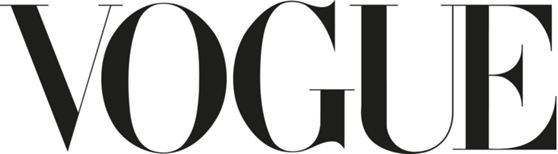

Vogue is an American monthly fashion and lifestyle magazine that released its first issue in 1892. Since then it has become the No.1 fashion magazine in the world. It is published in 18 countries and has a combined circulation of 16million. So, I have no doubt that you have seen the logo if not on the actual magazine I’m sure you have seen it on some of their merchandise that is often a fan favourite.  

The magazine covers many topics including: fashion, beauty, culture and living. As a publication it aims to “immerse itself in fashion, always leading readers to what will happen next”.  

Back in the mid 1900s, Vogue’s brand became a symbol of a new era that was more creative, emancipated and sexy.  These ideals are represented to this day through imagery, colours and most importantly (for us anyway) typography.  

After many years of chopping and changing. In 1955, the typeface that would be the permanent logo for Vogue was selected. The all uppercase Didot. Named after the brothers Pierre and Firmin Didot, the font was highly regarded by printers, publishers and typeface designers working in the 18th and 19th centuries. The typeface is characterised by its height, hairline serifs and big contrasts. These features accentuate the curves and variating thickness of each letter giving is a sophisticated yet sensual tone. This typeface screams elegance and luxury which is perfect for a fashion magazine which is aimed at a demographic of Women with an above average income.

For Vogue, colour is an integral part of its design but it’s important that it represents the story on the front page not the brand image therefore, the colour of the logo often changes. Additionally, Vogue doesn’t want their logo to overshadow the artistry and photography that graces the cover of their magazine. However, for general use Vogue maintains a plain black logo. The colour choice is simple and classic like the staple of the fashion industry … the little black dress.  

Overall, I just can’t fault this logo I think it represents the brand perfectly and it can be adapted through colour to help reduce friction with the images on the  front cover of the magazine which makes it hugely versatile.