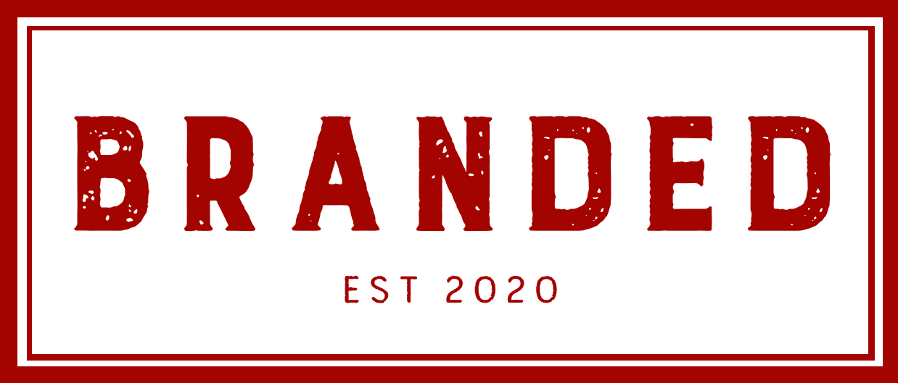
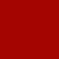
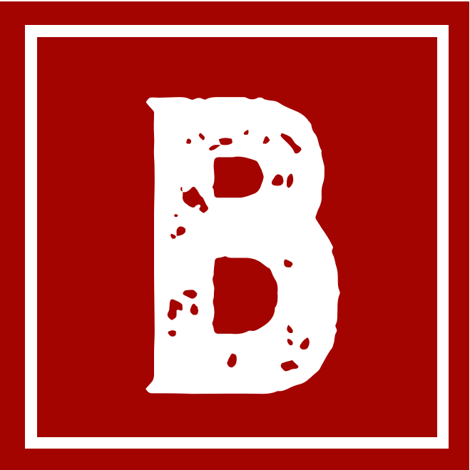

## Welcome to BRANDED.

On this website, I will be exploring typography in branding. I will be delving under the surface of some globally recognised brands to examine how effectively their typographic choices reflect their reputation and purpose. I will be sharing my thoughts in small articles which you will find on the main page. Please don't hesitate to join the discussion in the comment section below each article!

### More about this site:

#### My Logo and Banner Image:

Within my logo and banner image, I decided to emulate the style and iconography of a traditional branding stamp because of its association with the origins of branding as a concept. 

##### **Fun fact:**

> The term \[branding] derives from the Old Norse word brandr or "to burn", and refers to the practice of branding livestock, which dates back more than 4,000 years.

Back in the day, a brand was a symbol of ownership but in today's world, a brand represents a person or organisation's values and reputation. 

One of the defining features of a branding stamp is the strong bold lettering which has minimal contrast. This made the typeface Burford Rustic perfect for the task. Additionally, the speckled colouration adds to the appearance of it being stamped. 

#### Choice of Colour:

\#A30400 - Red 

\#FFFFFF - White 

The rust coloured red almost ages the logo but also stands out against the white background. 

My logo, which can be located on the far left of the menu bar, is a smaller simplified variation of my banner image. I inverted the colours so that the logo would stand out better as a Favicon on the browser tabs.